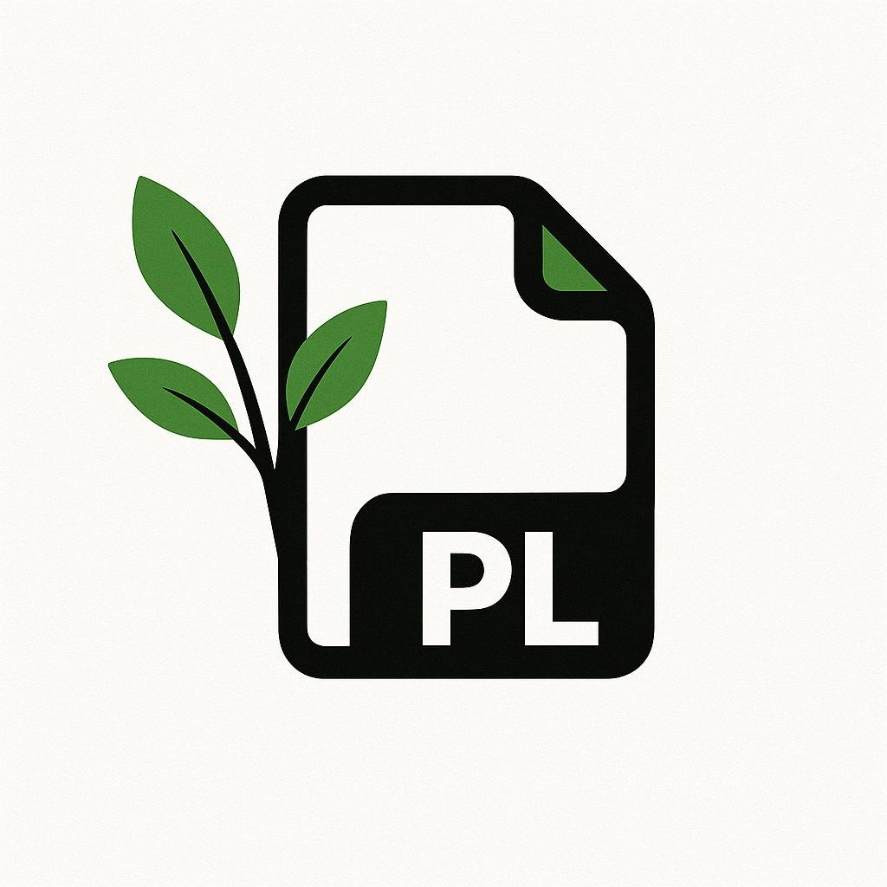

<h1 align="center" style="font-size: 3rem;">
  Paperlink
</h1>

  

  <em>A self-hosted PDF management and collaboration platform.</em>

---

## About

Paperlink is a web-based platform for storing, organizing, viewing, and editing PDFs.
It’s built to replace the messy workflow of scattered folders, random cloud drives, and multiple PDF tools.
With Paperlink, everything lives in one clean interface:
upload documents, annotate them in the browser, leave comments, and collaborate together in real time.

The entire system is designed for self-hosting, giving full control over documents and privacy.

---

## Features

* Drag & drop PDF upload
* Built-in PDF viewer
* Highlighting, shapes, text annotations
* Page-based comments with threads
* Live collaboration (WebSockets)
* Automatic versioning of all changes
* Workspaces and folders
* Tagging system
* Export PDFs with or without annotations
* Audit log for changes
* Backup options (database + files)

---

## Roles & Permissions

Paperlink uses three simple roles:

### Viewer

* View PDFs
* Read annotations and comments
* Add comments
* Cannot upload or edit documents

### Editor

* All Viewer abilities
* Upload PDFs
* Add and edit annotations
* Organize folders and tags
* Delete or restore their own files

### Admin

* Full system access
* Manage users and roles
* Change system settings
* Handle backups and restores
* Override any permissions

---

## Technology

* Frontend: Vue.js
* Backend: Go (REST API + WebSockets)
* Database: PostgreSQL
* PDF Rendering: PDF.js
* Deployment: Docker Compose

---

## Goals

* Simple storage for PDFs
* Web-based PDF viewing and editing
* Real-time collaboration
* Clear folder and tagging structure
* Stable, self-hosted setup

### Optional future additions

* OCR text recognition
* Pen/stylus input
* Usage statistics

### Not planned

* Support for non-PDF file types
* Mobile app
* Multilingual UI

---

## Team

* Elias Langthaler – Backend, Database
* Thomas Dietz – Backend, Database
* Philipp Schwarzinger – Frontend
* Niklas Zagler – Frontend, Documentation
* Jan Paul Birchmann – Design, Testing

---

## Vision

To offer a fast, modern, self-hosted way to work with PDFs together —
without relying on external services, paid tools, or locked-down ecosystems.

